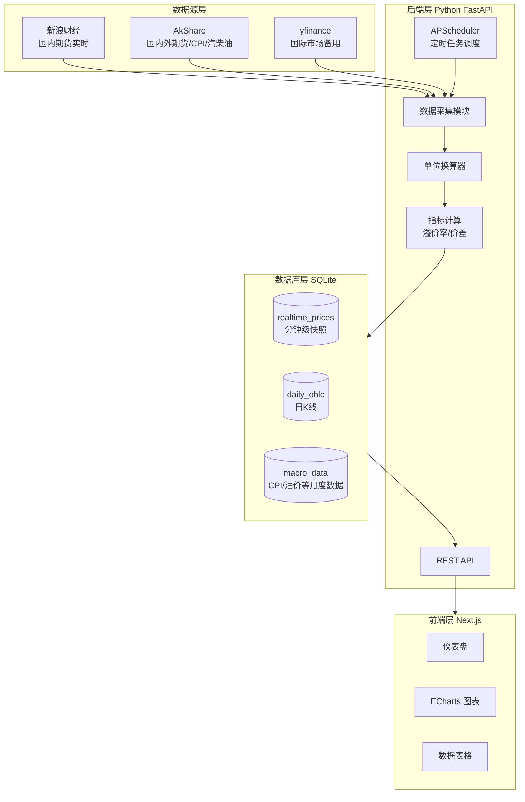
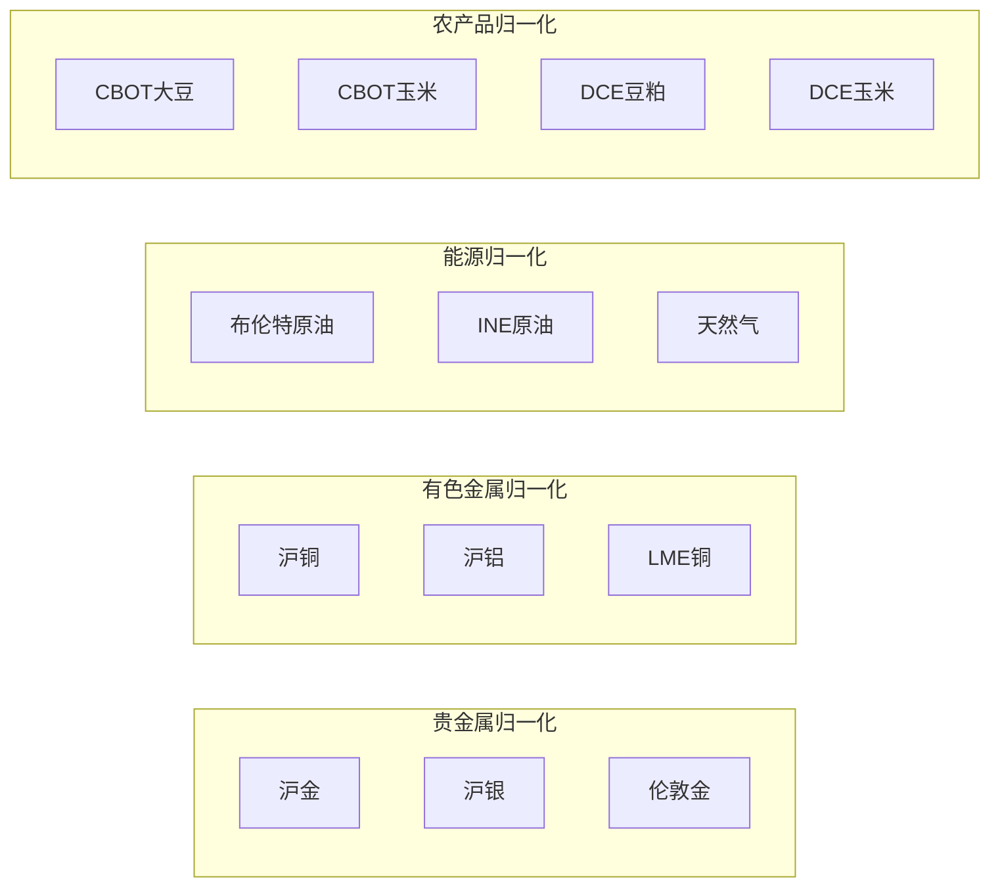

# 大宗商品战情室 - 架构方案讨论

## 一、对现有架构的评估

### 优点

- **技术栈选型合理**：FastAPI + Next.js + ECharts 是成熟组合
- **数据源思路正确**：新浪期货接口确实是国内期货数据的常用来源
- **Docker 部署方便**：便于迁移和备份

### 需要改进/细化的地方


| 问题        | 建议                           |
| --------- | ---------------------------- |
| Celery 过重 | 本地运行用 APScheduler 即可，减少依赖复杂度 |
| 数据源单一     | 新浪接口不稳定，需要备用方案               |
| 缺少部分数据源   | CPI、汽柴油零售价、LME 数据源未明确        |
| 表结构过于简单   | 需要区分不同数据频率（tick/日线/月度）       |


---

## 二、推荐的优化架构




---

## 三、关键改进建议

### 1. 数据源：强烈推荐引入 AkShare

**为什么？**

- 开源 Python 库，封装了 100+ 数据源
- 涵盖您需要的几乎所有数据：国内期货、LME、CPI、汽柴油价格
- 比直接调用新浪接口更稳定，有错误处理

**示例代码**：

```python
import akshare as ak

# 国内期货实时行情（沪金、沪银、沪铜、沪铝、原油等）
futures_zh = ak.futures_zh_spot(symbol="AU0")  # 沪金主力

# LME 金属
lme_data = ak.futures_foreign_hist(symbol="LME铜")

# 中国 CPI
cpi_cn = ak.macro_china_cpi_monthly()

# 美国 CPI
cpi_us = ak.macro_usa_cpi_monthly()

# 国内汽柴油历史价格
oil_price = ak.energy_oil_hist()
```

### 2. 数据库表结构建议

```sql
-- 实时/分钟级数据（交易时段每分钟采集）
CREATE TABLE realtime_prices (
    id INTEGER PRIMARY KEY,
    timestamp DATETIME NOT NULL,
    symbol VARCHAR(20) NOT NULL,      -- 如 'SHFE.AU', 'LME.CU'
    name VARCHAR(50),                  -- 如 '沪金主力'
    price DECIMAL(15,4) NOT NULL,
    price_cny DECIMAL(15,4),          -- 换算后的人民币价格
    unit VARCHAR(10),                  -- 原始单位 'USD/oz', 'CNY/g'
    market VARCHAR(10),               -- 'CN', 'US', 'LME'
    UNIQUE(timestamp, symbol)
);

-- 日K线数据（永久保存）
CREATE TABLE daily_ohlc (
    id INTEGER PRIMARY KEY,
    date DATE NOT NULL,
    symbol VARCHAR(20) NOT NULL,
    open DECIMAL(15,4),
    high DECIMAL(15,4),
    low DECIMAL(15,4),
    close DECIMAL(15,4),
    volume BIGINT,
    UNIQUE(date, symbol)
);

-- 宏观/低频数据
CREATE TABLE macro_data (
    id INTEGER PRIMARY KEY,
    date DATE NOT NULL,
    indicator VARCHAR(50) NOT NULL,   -- 'CPI_CN', 'CPI_US', 'GASOLINE_CN'
    value DECIMAL(15,4),
    yoy_change DECIMAL(10,4),         -- 同比变化
    UNIQUE(date, indicator)
);

-- 计算指标（溢价率等）
CREATE TABLE spread_data (
    id INTEGER PRIMARY KEY,
    timestamp DATETIME NOT NULL,
    pair VARCHAR(50) NOT NULL,        -- 'GOLD_CN_US', 'COPPER_SHFE_LME'
    domestic_price DECIMAL(15,4),
    foreign_price DECIMAL(15,4),
    spread_rate DECIMAL(10,4),        -- 溢价率 %
    UNIQUE(timestamp, pair)
);
```

### 3. 后端简化：用 APScheduler 替代 Celery

```python
from apscheduler.schedulers.background import BackgroundScheduler
from fastapi import FastAPI

app = FastAPI()
scheduler = BackgroundScheduler()

# 交易时段每分钟采集国内期货
@scheduler.scheduled_job('cron', minute='*', hour='9-11,13-15', day_of_week='mon-fri')
def fetch_cn_futures():
    # 采集逻辑
    pass

# 每天收盘后更新日K线
@scheduler.scheduled_job('cron', hour='16', minute='0')
def update_daily_ohlc():
    pass

# 每月更新 CPI 数据
@scheduler.scheduled_job('cron', day='15', hour='10')
def update_macro_data():
    pass

scheduler.start()
```

### 4. 单位换算模块设计

```python
CONVERSION_CONFIG = {
    'XAU': {
        'from_unit': 'USD/oz',
        'to_unit': 'CNY/g',
        'oz_to_gram': 31.1035,
    },
    'LME_CU': {
        'from_unit': 'USD/ton',
        'to_unit': 'CNY/ton',
    },
    # ... 其他品种
}

def convert_price(symbol: str, price: float, exchange_rate: float) -> float:
    """将国际价格换算为人民币价格"""
    config = CONVERSION_CONFIG.get(symbol)
    if not config:
        return price
    
    if 'oz_to_gram' in config:
        # 金银：美元/盎司 -> 人民币/克
        return price * exchange_rate / config['oz_to_gram']
    else:
        # 铜铝等：美元/吨 -> 人民币/吨
        return price * exchange_rate
```

---

## 四、数据源完整映射


| 品种               | 数据源              | AkShare 接口                         | 备注     |
| ---------------- | ---------------- | ---------------------------------- | ------ |
| XAU/USD, XAG/USD | AkShare/yfinance | `futures_foreign_hist`             | 国际金银   |
| SHFE 黄金/白银       | AkShare          | `futures_zh_spot("AU0")`           | 沪金沪银主力 |
| LME 铜/铝          | AkShare          | `futures_foreign_hist("LME铜")`     | 伦敦金属   |
| SHFE 沪铜/沪铝       | AkShare          | `futures_zh_spot("CU0")`           | 上期所    |
| Brent 原油         | AkShare          | `futures_foreign_hist("布伦特原油")`    | ICE    |
| 天然气              | AkShare          | `futures_foreign_hist("NYMEX天然气")` | NYMEX  |
| INE 原油           | AkShare          | `futures_zh_spot("SC0")`           | 上海能源   |
| PTA/甲醇           | AkShare          | `futures_zh_spot("TA0"/"MA0")`     | 郑商所    |
| CBOT 大豆/玉米       | AkShare          | `futures_foreign_hist("CBOT大豆")`   | 芝加哥    |
| DCE 豆粕/玉米        | AkShare          | `futures_zh_spot("M0"/"C0")`       | 大商所    |
| DCE 生猪           | AkShare          | `futures_zh_spot("LH0")`           | 大商所    |
| 中国 CPI           | AkShare          | `macro_china_cpi_monthly()`        | 月度     |
| 美国 CPI           | AkShare          | `macro_usa_cpi_monthly()`          | 月度     |
| 汽柴油零售价           | AkShare          | `energy_oil_hist()`                | 发改委调价  |


---

## 五、前端页面结构建议

```
/                      # 仪表盘首页
├── 顶部指标卡片        # 关键品种实时价格 + 涨跌幅
├── 溢价率仪表盘        # Gauge 图：金/铜/油的内外价差
├── 品种轮动热力图      # 各品种近期涨跌热力图
└── 快速跳转入口

/metals               # 金属板块
├── 贵金属（金银）
└── 有色金属（铜铝）

/energy               # 能源板块
├── 原油（布伦特/INE）
├── 天然气
└── 化工（PTA/甲醇）

/agriculture          # 农产品板块
├── 油脂油料（大豆/豆粕）
├── 谷物（玉米）
└── 生猪

/macro                # 宏观数据
├── 中美 CPI 对比图
└── 汽柴油调价历史

/settings             # 设置页
└── 数据刷新频率配置
```

---

## 六、风险和注意事项

1. **接口限流**：AkShare 底层调用的数据源可能有频率限制，建议设置合理的采集间隔（1-2分钟）
2. **交易时段**：国内期货交易时段包括夜盘（21:00-02:30），调度任务需覆盖
3. **数据清洗**：不同源的数据格式不一致，需要统一处理
4. **历史数据初始化**：首次运行需要批量导入历史数据，建议单独写脚本

---

## 七、目录结构建议

```
大宗战情室/
├── backend/
│   ├── app/
│   │   ├── main.py           # FastAPI 入口
│   │   ├── scheduler.py      # 定时任务
│   │   ├── fetchers/         # 各数据源采集器
│   │   ├── converters/       # 单位换算
│   │   ├── models/           # 数据模型
│   │   └── api/              # API 路由
│   ├── data/
│   │   └── commodities.db    # SQLite 数据库
│   ├── requirements.txt
│   └── Dockerfile
├── frontend/
│   ├── src/
│   │   ├── pages/
│   │   ├── components/
│   │   └── charts/           # ECharts 封装
│   ├── package.json
│   └── Dockerfile
└── docker-compose.yml
```

---

## 八、核心功能：溢价率计算器 (Calculator)

这是发现套利机会的核心模块，**所有指标全部由公式自动计算**，无需手动填写。

### 汇率数据源（双保险）

```python
import akshare as ak

def get_exchange_rate() -> float:
    """获取美元兑人民币汇率，双数据源保障"""
    try:
        # 主数据源：AkShare 实时汇率
        df = ak.currency_boc_sina(symbol="美元")
        return float(df.iloc[-1]['中行折算价'])
    except Exception:
        # 备用数据源：央行中间价
        df = ak.macro_china_fx_spot()
        return float(df[df['货币'] == '美元']['中间价'].iloc[-1])
```

### 计算公式

```python
# === 基础换算 ===
exchange_rate = get_exchange_rate()  # 如 7.25

# === 理论价格计算 ===
# 黄金：伦敦金(USD/oz) -> 人民币/克
theoretical_gold_cny = london_gold_usd / 31.1035 * exchange_rate

# 白银：伦敦银(USD/oz) -> 人民币/千克
theoretical_silver_cny = london_silver_usd / 31.1035 * exchange_rate * 1000

# 铜：LME铜(USD/ton) -> 人民币/吨
theoretical_copper_cny = lme_copper_usd * exchange_rate

# 铝：LME铝(USD/ton) -> 人民币/吨
theoretical_aluminum_cny = lme_aluminum_usd * exchange_rate

# === 溢价率计算 ===
# 溢价率 = (实际国内价 - 理论价) / 理论价 × 100%
gold_premium = (shfe_gold - theoretical_gold_cny) / theoretical_gold_cny * 100
silver_premium = (shfe_silver - theoretical_silver_cny) / theoretical_silver_cny * 100
copper_premium = (shfe_copper - theoretical_copper_cny) / theoretical_copper_cny * 100
aluminum_premium = (shfe_aluminum - theoretical_aluminum_cny) / theoretical_aluminum_cny * 100

# === 比值指标 ===
# 金银比 = 金价 / 银价（历史均值约 60-80）
gold_silver_ratio = london_gold_usd / london_silver_usd

# 铜金比 = 铜价 / 金价（经济温度计，比值高=经济好，比值低=避险情绪）
copper_gold_ratio = lme_copper_usd / london_gold_usd
```

### 信号解读规则（前端可视化）


| 指标    | 阈值    | 信号  | 解读           |
| ----- | ----- | --- | ------------ |
| 黄金溢价率 | > +2% | 红灯  | 国内抢金，恐慌情绪浓厚  |
| 黄金溢价率 | < -2% | 绿灯  | 国内金价偏低，可能有机会 |
| 铜溢价率  | < -5% | 绿灯  | 国内铜便宜，做多机会   |
| 铜溢价率  | > +5% | 红灯  | 国内铜溢价过高      |
| 金银比   | > 80  | 警示  | 避险情绪高涨，白银被低估 |
| 金银比   | < 60  | 警示  | 白银可能被高估      |
| 铜金比   | 上升趋势  | 📈  | 经济预期改善       |
| 铜金比   | 下降趋势  | 📉  | 经济预期恶化，避险升温  |


### 后端 API 接口

```python
@app.get("/api/calculator")
def get_calculator_data():
    """返回溢价率计算器的完整数据"""
    return {
        "timestamp": "2026-01-29 15:30:00",
        "exchange_rate": 7.25,
        "gold": {
            "london_usd_oz": 2650.50,
            "shfe_cny_g": 620.80,
            "theoretical_cny_g": 618.45,
            "premium_rate": 0.38  # %
        },
        "silver": {...},
        "copper": {...},
        "aluminum": {...},
        "ratios": {
            "gold_silver": 84.95,
            "copper_gold": 3.47
        },
        "signals": {
            "gold_premium": "normal",  # high/low/normal
            "copper_premium": "normal",
            "gold_silver_ratio": "high_alert",
            "economic_sentiment": "neutral"
        }
    }
```

---

## 九、归一化对比图表

将不同品种的价格归一化到同一基准（如以某日为 100），便于对比走势。

### 归一化公式

```python
# 以起始日收盘价为基准 100
normalized_price = current_price / base_price * 100

# 示例：2025-01-01 为基准日
# 黄金从 600 涨到 620 → 归一化值 = 620/600*100 = 103.33
```

### 图表分组




### 后端 API

```python
@app.get("/api/normalized")
def get_normalized_data(
    group: str,  # "precious_metals", "base_metals", "energy", "agriculture"
    base_date: str = None,  # 基准日期，默认1年前
    period: str = "1y"  # 1m, 3m, 6m, 1y, 3y, all
):
    """返回归一化后的多品种数据"""
    return {
        "base_date": "2025-01-29",
        "base_value": 100,
        "series": [
            {"name": "沪金", "symbol": "SHFE.AU", "data": [[timestamp, value], ...]},
            {"name": "沪银", "symbol": "SHFE.AG", "data": [...]},
            {"name": "伦敦金", "symbol": "XAU", "data": [...]}
        ]
    }
```

---

## 十、数据导出功能

### 导出格式

- **CSV**：通用格式，Excel/Python/R 都能读取
- **Excel**：带格式的 .xlsx 文件

### 导出内容选项

1. **实时快照**：当前所有品种的最新价格
2. **历史数据**：指定品种、指定时间范围的日K线
3. **溢价率历史**：溢价率计算器的历史记录
4. **宏观数据**：CPI、汽柴油价格等

### 后端 API

```python
from fastapi.responses import StreamingResponse
import pandas as pd
import io

@app.get("/api/export")
def export_data(
    type: str,  # "snapshot", "history", "premium", "macro"
    format: str = "csv",  # "csv" or "xlsx"
    symbols: str = None,  # 逗号分隔的品种代码
    start_date: str = None,
    end_date: str = None
):
    """导出数据为 CSV 或 Excel"""
    df = fetch_export_data(type, symbols, start_date, end_date)
    
    if format == "csv":
        buffer = io.StringIO()
        df.to_csv(buffer, index=False, encoding='utf-8-sig')
        return StreamingResponse(...)
    else:
        buffer = io.BytesIO()
        df.to_excel(buffer, index=False)
        return StreamingResponse(...)
```

---

## 十一、更新后的页面结构

```
/                           # 仪表盘首页
├── 顶部指标卡片             # 关键品种实时价格 + 涨跌幅
├── 溢价率仪表盘             # Gauge 图：金/铜的内外价差
├── 信号灯面板              # 溢价率信号解读
└── 快速跳转入口

/calculator                 # 溢价率计算器（核心页面）
├── 实时数据表格            # 所有品种的溢价率、比值
├── 信号解读面板            # 红绿灯 + 文字说明
└── 历史溢价率走势图         # 可选择不同品种

/charts                     # 归一化图表页
├── 贵金属归一化            # 金/银/伦敦金
├── 有色金属归一化          # 铜/铝/LME
├── 能源归一化              # 原油/天然气
└── 农产品归一化            # 大豆/玉米/豆粕

/metals                     # 金属详情页
/energy                     # 能源详情页
/agriculture                # 农产品详情页
/macro                      # 宏观数据页

/export                     # 数据导出页
├── 选择导出类型
├── 选择品种
├── 选择时间范围
└── 下载按钮
```

---

## 十二、确认的需求清单

- 不需要用户认证
- 需要数据导出功能（CSV/Excel）
- 暂不需要价格预警
- 需要归一化对比图表（金银/能源/农产品分组）
- 需要溢价率自动计算器（核心功能）
- 需要金银比、铜金比等衍生指标
- 需要信号解读（红绿灯提示）

